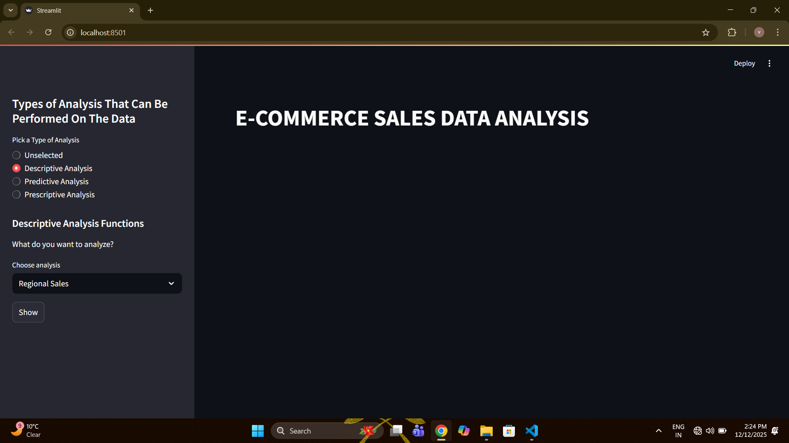

# E-COMMERCE SALES INTELLIGENCE SYSTEM.

>**This is a end to end data analytics pipeline demonstrating SQL,Python and Excel Automation For Business Intelligence**

Images from the project are:

## Project Overview
A comprehensive sales analytics system that simulates real word business data workflow.
This Project demonstrates Proficiency in **data collection**,**data visualization**,**SQL analytics**,**Python automation**,**Business Reporting**,**database management**- which are the key skills required by a data analyst.

### Business Problem
E-Commerce Businesses need automated analytics to:
-Track their sales ,performace, trends, management.
-Identify their Best Products , Worst Products, Best Customers, etc.
-Optimize Product Inventory.
-Make data-driven decisions.

**Challenges:** Manual reporting takes many hours and is error prone.

**Solution:** An Automated pipeline which processes data, Perform analysis, and generate reports in a very short time.

## Key Features

### **Descriptive Analysis**
The Descriptive Analysis used on the data is used to analyze the current position of the business:
Shows Analysis Like:
-Total Orders 
-Total Profit Generated
-Monthly Sales
-Yearly Sales
-Categorical Sales
-Regional Sales

### **Predictive Analysis**
The Predictive Analysis used on the data for forecasting the future of the business:
Shows Analysis Like:
-RFM (Recency,Frequency,Monetary) Signals
-Seasonal Demands
-Product Performance Trends
-High Risk Orders

### **Prescriptive Analysis**
The Prescriptive Analysis used on the data to analyze the current moves to be made for the future of the business:
Shows Analysis Like:
-Products To Discount (Which Products Needs Discounts for generated more sales)
-Seasonal Demands 
-Product Performance Trends
-High Risk Orders
-Products To Promote (Which Products Needs to be promoted more in the markets for increasing sales) 

### **Automation**
-Automated Excel report generation
-Interactive Streamlit Dashboard For Visualization 
-Reproducible analysis pipeline

## Tech Stack
Category             :      Technologies 

**Database**         :       SQLite, SQl
**Language**         :       Python 3.13
**Data Analysis**    :       Pandas
**Visualization**    :       Plotly, Plotly.express
**Dashboard**        :       Streamlit
**Reporting**        :       Openpyxl, Xlsxwriter
**Development**      :       Jupyter Notebooks, VS Code
**Version Control**  :       GitHub, Git

## Project Structure
'''
E-Commerce Sales Intelligence/
|--dashboard/
|   |__app.py                                         # Streamlit Dashboard
|
|--data/
|   |__sales_data.csv                                 # Data Containing 50000+ rows
|
|--database/
|   |--queries/                                        # Sql Queries
|   |   |--Descriptive_queries.sql
|   |   |--Predictive_queries.sql
|   |   |__Prescripive_queries.sql
|   |__ecommerce.db                                     # Database
|
|--reports/                                             # Generated reports
|   |--Descriptive_Analysis_reports.xlsx
|   |--Predictive_Analysis_reports.xlsx
|   |__Prescriptive_Analysis_reports.xlsx
|
|--src/                                                  
|   |--analytics.py                                      #Source Code for reusable query functions.
|   |--csv_to_database.py         #Source Code for inspecting one csv file to multiple csv files and for converting into database.
|   |__excel_reporter.py                                 # Souce Code to Generate Excel Reports.
|
|--T_notebooks                                         # Notebooks for using the query functions and to analyze data
|   |--Descriptive_analysis.ipynb                   
|   |--Predictive_analysis.ipynb
|   |__Prescriptive_analysis.ipynb
|
|--venv/                                             # virtual Environment
|
|--PROJECT_BRIEF.md                                  # Shows Logical thinking used in the making of project
|
|--README.md                                         # README file 
|
|--.gitignore                                        #git ignore file
|
|___requirements.txt                                 # packages used in project
'''

## Skills Demonstrated

### Technical Skills

**SQL Proficiency**
- Learned SQL queries
- Made Functions for analysis
- Designed Database

**Python Development**
- Object Oriented Programming
- Pandas for data manipulation
- Automated report generation
- Error Handling

**Data Analysis**
- Descriptive Analysis
- Predictive Analysis
- Prescriptive Analysis

**Business Intelligence**
- DashBoard Designing
- Automated reporting
- Data-driven recommendations

### Soft Skills
- Problem-Solving and analytical thinking
- Communication through documentation
- Project organisation and structure
- Self-Directed Learning
- Project-Based Learning

## Project Metrices
-**Lines Of Code:** 700+
-**SQL Queries:** 25+ Analytical queries
-**Data Points:** 50,000+ rows of data
-**Analysis Notebooks:** 3 comprehensive notebooks
-**Automated Reports:** 3 generated excel files with multiple sheets showcasing each type of analysis
-**Development Time:** 3 days (<72 hours)

## Contact
**Vishank Tyagi**
Email: tyagivishank1234@gmail.com
LinkedIn: https://www.linkedin.com/in/vishank-t/
GitHub: https://github.com/VishankTyagi07

## Star This Repository
If you found this project helpful or interesting,please consider giving it a star! It helps others to discover the project.

**Built with :heart: by Vishank Tyagi | December 2025**

*This Project demonstrates end-to-end data analytics capabilities suitable for Data Analyst,Business Intelligence Analyst, and Analytics Engineer Roles*